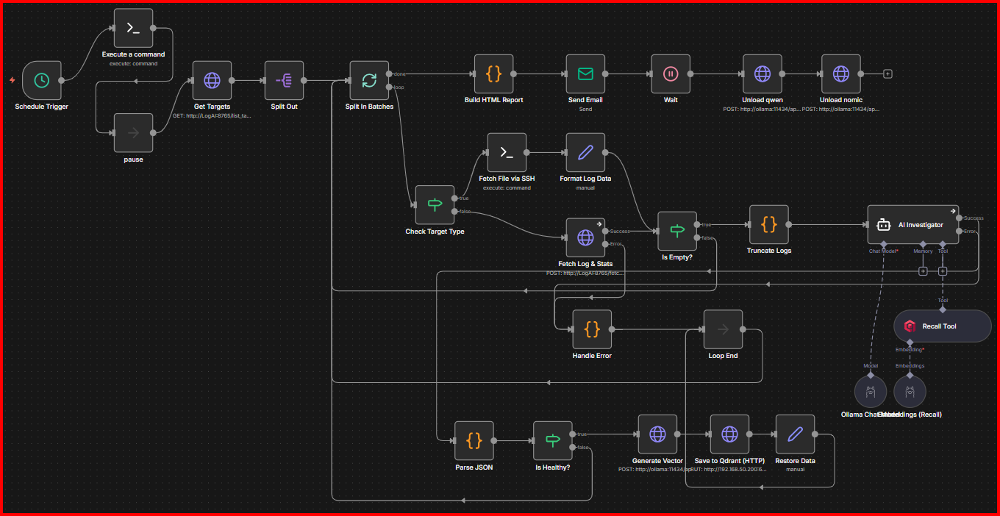

# LogAI: Automated Infrastructure Reporting Agent



This is an n8n workflow that automates daily server infrastructure reporting. It aggregates logs from Docker containers and system files, uses AI (Ollama) to analyze them for errors, and emails a formatted HTML report.

## Stack Components
1.  **LogAI API (Python):** Custom fetcher for Docker and System logs. A custom FastAPI wrapper that reads Docker logs via socket and System logs via file mount. It also acts as an SMTP proxy to simplify TLS handling for n8n.
2.  **n8n:** Workflow automation engine. Orchestrates the flow: Fetch Logs -> Embed -> Check History -> Analyze -> Email Report.
3.  **Ollama:** Local LLM inference - running `qwen2.5:14b` model to analyze logs "intelligently" rather than just keyword searching.
4.  **Qdrant:** Vector database for storing historical log error patterns. Stores embeddings of past errors. The AI checks this to tell you if an error is "Recurring" or "New".

## Features
* **Hybrid Collection:** Fetches logs from Docker containers and System files (`/var/log/syslog`).
* **AI Analysis:** Uses local LLM (Qdrant + Ollama) to identify root causes and filter noise.
* **Vector Memory:** Checks Qdrant to see if an error has happened before.
* **Smart Reporting:** Generates a color-coded HTML dashboard sent via Email.

---

## 🚀 Quick Start

### 1. Prerequisites
* Docker & Docker Compose installed.
* **n8n** (Self-hosted).
* **Ollama** running `qwen2.5:14b` and `nomic-embed-text`.
* **Qdrant** (Vector Database).
* SSH Access to the target server (for system logs).
* A server with resources to run an LLM (16GB+ RAM recommended for `qwen2.5:14b`).
* SMTP credentials (or a local Mailcow instance).

### 2. Installation

1.  **Clone the repository:**
    ```bash
    git clone [https://github.com/Gabsthejerk/LogAI.git](https://github.com/Gabsthejerk/LogAI.git)
    cd LogAI
    ```

2.  **Configure the Environment:**
    Create a `.env` file in the root directory to define your mail server settings.
    ```bash
    # Create .env from example or scratch
    echo "MAILCOW_IP=192.168.1.100" >> .env
    echo "MAILCOW_PORT=465" >> .env
    ```
    *Replace the IP and Port with your actual SMTP server details.*

3.  **Start the Stack:**
    ```bash
    docker-compose up -d --build
    ```

4.  **Download LLM Models:**
    Once the containers are running, pull the necessary models into Ollama:
    ```bash
    docker exec -it ollama ollama pull qwen2.5:14b
    docker exec -it ollama ollama pull nomic-embed-text
    ```

### 3. n8n Setup (The Workflow)

1.  Open n8n at `http://localhost:5678`.
2.  Create a new workflow.
3.  Click the **three dots** (top right) -> **Import from File**.
4.  Select `workflow/LogAI.json` from this repository.
5.  **Configure Credentials:**
    You will need to create credentials in n8n for:
    * **Ollama:** Base URL `http://ollama:11434`
    * **Qdrant:** Base URL `http://qdrant:6333`
    * **SSH:** Access to your host (user/pass or key) to read system logs.
    * **SMTP:** Your email sending credentials.

---

## ⚙️ Custom Configuration

### Modifying Ignored Containers
To prevent LogAI from analyzing certain containers (like itself), edit `api/log_analyzer.py`:

```python
# api/log_analyzer.py
IGNORE_CONTAINERS = ["LogAI", "ollama", "qdrant", "your-other-container"]